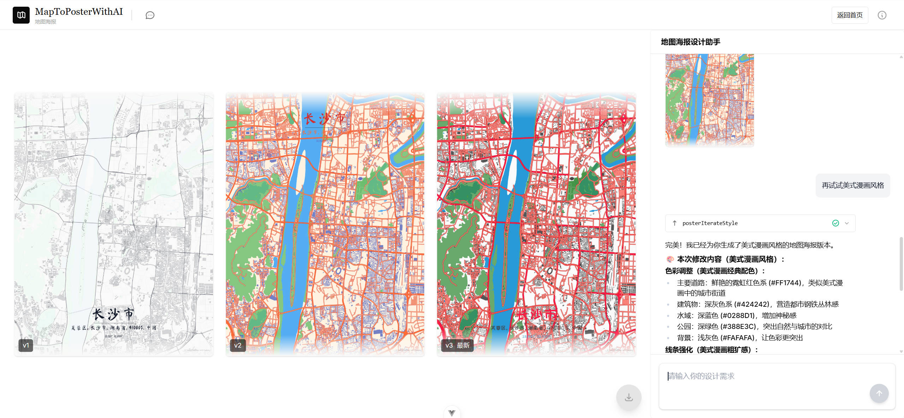
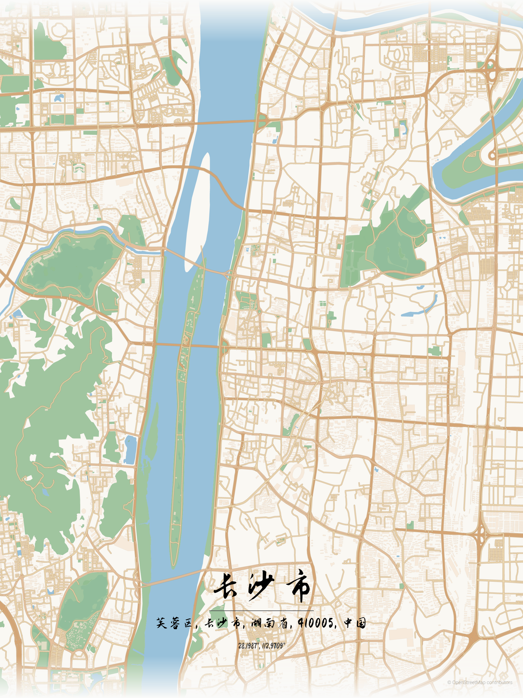

# MapToPosterWithAI

**[English](./README.md)** | **[中文](./README.zh-CN.md)**

AI 辅助生成地图海报：输入地名 → 选择专题与主题 → 服务端渲染海报 → 通过对话迭代风格，生成更漂亮的地图海报。

- 数据：OpenStreetMap（Overpass / Nominatim）
- 渲染：服务端 SVG → PNG（`@resvg/resvg-js`）
- AI：Mastra Agent + Tool（可控的主题覆盖 JSON）
- 交互：SSE 事件流（AI tool-result 到达后自动刷新版本）

灵感来源：[originalankur/maptoposter](https://github.com/originalankur/maptoposter)（在 maptoposter 思路上加入 AI 对话，辅助海报风格迭代与主题调整）。

## 示例

### 界面

[](./assets/user-interface.jpg)
[](./assets/user-interface2.jpg)

### 海报结果

[](./assets/chang-sha.png)
[](./assets/beijing.png)
[](./assets/washington.png)
[](./assets/new-york.png)

## 目录

- [功能](#功能)
- [技术栈](#技术栈)
- [快速开始](#快速开始)
- [使用流程](#使用流程)
- [仓库结构](#仓库结构)
- [常用命令](#常用命令)
- [排障](#排障)
- [致谢](#致谢)
- [License](#license)

## 功能

- 地名搜索与候选选择（Nominatim）
- 4 类海报专题：绿地 / 道路 / 建筑 / 水系
- 主题库（`themes-v1`）：可选择、可扩展
- 服务端渲染：OSM 要素 + Theme → SVG → PNG
- 版本管理：每次生成/迭代产生一个版本（v1/v2/v3…）
- AI 设计助手：通过对话调整 `palette / tuning / typography`，生成新版本
- OSM 数据缓存（SQLite）：减少 Overpass 请求与等待时间

> 注意：当前海报「会话/版本元数据」为内存存储（重启后端会丢失索引）；海报 PNG 产物会写入本地目录。

## 技术栈

- 前端：Vue 3 + Vite + TailwindCSS
- 后端：Node.js + Express + Mastra
- 地图数据：Overpass API（OSM）+ Nominatim（地理编码）
- 存储：OSM Cache（SQLite）；海报产物本地文件；Agent/Mastra 存储使用 LibSQL（本地文件或远程）

## 快速开始

### 1) 环境要求

- Node.js `>= 22.14.0`
- pnpm `>= 10.15.1`（推荐 Corepack 管理版本）

### 2) 安装依赖

```bash
pnpm install
```

### 3) 配置环境变量

分别复制两份示例配置为 `.env`：

```bash
cp apps/backend/.env.example apps/backend/.env
cp apps/frontend/.env.example apps/frontend/.env
```

你至少需要关注这些变量：

- `apps/backend/.env`
  - `AI_EXAMPLE_AGENT_*`：AI 设计助手（可选；不配置也能生成初版海报，但无法使用 AI 对话迭代）
  - 生产部署注意：
    - `POSTER_WORKER_POOL_SIZE`：海报 Worker 池大小（并行渲染线程数），默认 1；2G2C 服务器建议 1，4G4C 可设为 2
    - `POSTER_WORKER_MEMORY_LIMIT_MB`：每个 Worker 最大老生代内存（MB），默认 256；2G2C 建议 256，4G+ 可设为 512
  - 其他：
    - `POSTER_MAX_FEATURES_PER_LAYER`：每个图层最大 feature 数量（防止大城市数据爆炸），默认 50000
    - `GEOCODE_BBOX_CENTER_SCALE`：Geocode bbox 中心点缩放比例，范围 0–1，默认 0.5
    - `GEOCODE_BBOX_MAX_RADIUS_KM`：Geocode bbox 最大半径（km），用于限制 bbox 范围并降低 OSM 数据量，默认 50
    - `POSTER_PNG_DPI`：海报导出 PNG 的 DPI，默认 300
- `apps/frontend/.env`
  - `VITE_DEV_API_PROXY_TARGET`：开发时 API 代理目标（默认 `http://localhost:3000`）

### 4) 启动开发环境

开两个终端分别启动后端与前端：

```bash
pnpm -C apps/backend dev
```

```bash
pnpm -C apps/frontend dev
```

打开 Vite 输出的地址（通常是 `http://localhost:5173`）。

## 使用流程

1. 首页选择海报专题（绿地/道路/建筑/水系），输入地名（城市、区域、地址…）
2. 从候选列表中选择目标地点（后端会基于 bbox 拉取 OSM 数据并生成 v1）
3. 进入编辑页：
   - 画布区域可查看历史版本预览
   - 右侧「地图海报设计助手」对话，提出风格需求（如：更高对比度、水更蓝、道路更细、换字体、标题移到上方…）
   - 每次 tool 调用成功会生成新版本（v2/v3/…），前端自动刷新
4. 选中任意版本并下载 PNG

## 仓库结构

```text
.
├─ apps/
│  ├─ backend/                 # Express + Mastra + 渲染/缓存
│  │  ├─ runtime-assets/       # themes-v1 / fonts
│  │  └─ src/
│  └─ frontend/                # Vue 3 + Vite UI
│     └─ src/
```

## 常用命令

- 根目录
  - `pnpm lint`：Prettier + ESLint + cspell
- 后端（`apps/backend`）
  - `pnpm dev`：开发（`tsx watch src/index.ts`）
  - `pnpm build`：构建到 `dist/`
  - `pnpm start`：运行构建产物
  - `pnpm mastra:dev`：启动 Mastra Studio（可选）
- 前端（`apps/frontend`）
  - `pnpm dev`：开发
  - `pnpm build`：构建
  - `pnpm preview`：本地预览构建产物

## 排障

- Overpass / Nominatim 请求慢或失败
  - 公共实例可能限流；建议更换/自建端点（见 `OSM_OVERPASS_ENDPOINT` / `NOMINATIM_ENDPOINT`）
  - 后端默认启用 SQLite 缓存，可减少重复拉取（`OSM_CACHE_MAX_BYTES`）

## 致谢

- 灵感来源：[originalankur/maptoposter](https://github.com/originalankur/maptoposter)（在 maptoposter 思路上加入 AI 对话，辅助海报风格迭代与主题调整）
- 地图数据：[OpenStreetMap（OSM）](https://www.openstreetmap.org/)（© OpenStreetMap contributors）
- 地名解析：[Nominatim](https://nominatim.org/)（用于地名搜索、候选列表与地理编码解析服务）
- 数据获取：[Overpass API](https://wiki.openstreetmap.org/wiki/Overpass_API)（用于按 bbox/条件查询并获取 OSM 要素数据）

## License

MIT（见 `LICENSE`）。
